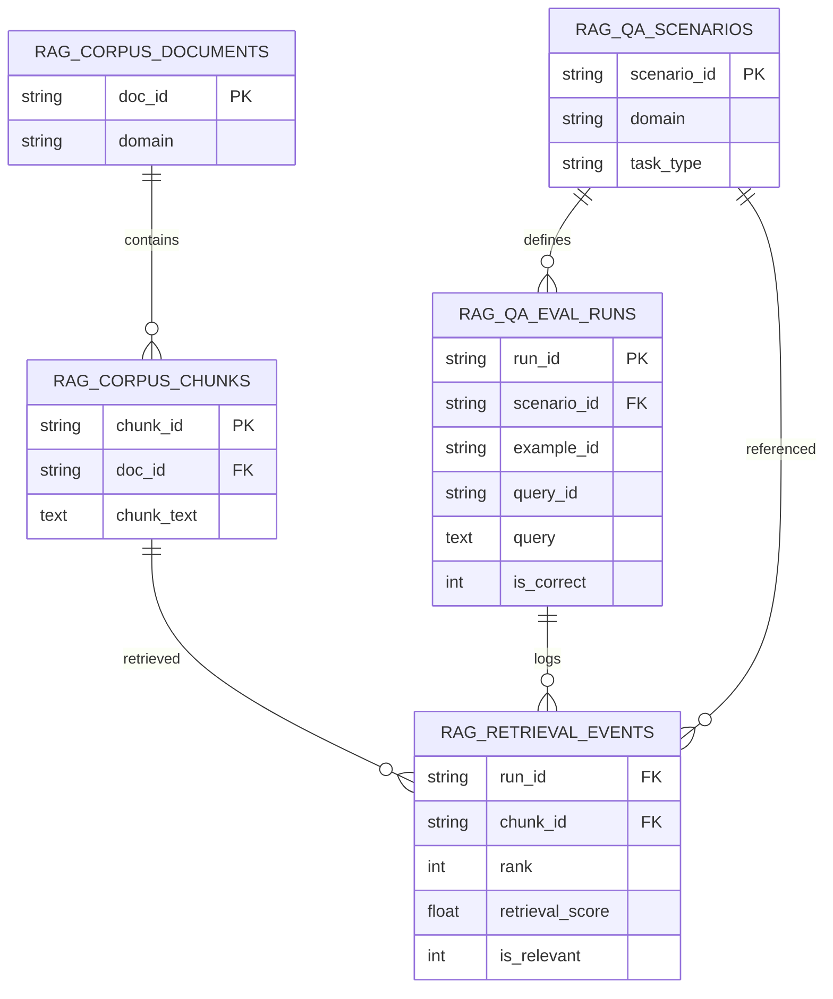

# Schema & Join Map

This dataset is **relational** (multiple linked tables). Use stable IDs to join:

- `doc_id` → documents ↔ chunks  
- `chunk_id` → chunks ↔ retrieval events  
- `run_id` → eval runs ↔ retrieval events  
- `scenario_id` → scenarios ↔ eval runs / retrieval events  
- `example_id` → per-question example (carried in eval runs + retrieval events)  
- `query_id` → stable query identifier (carried in eval runs + retrieval events)

## Mermaid ER-style overview



## “Flat table” view

If you want a **single table** for analytics / dashboards, run:

```bash
python scripts/build_flat_table.py --data-dir data --out data/derived/flat_rag_events.parquet
```

This produces one row per **retrieved chunk per run**, with run-level labels replicated.
